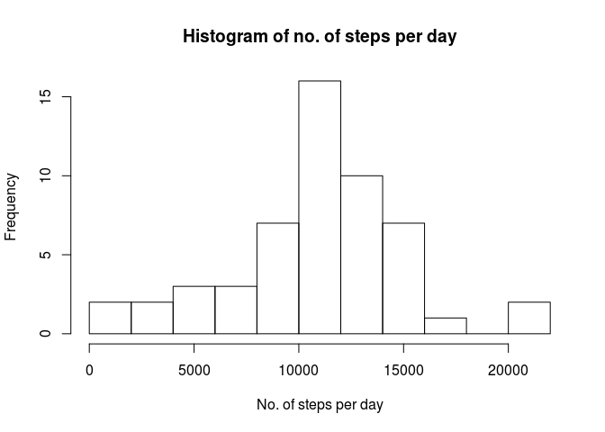
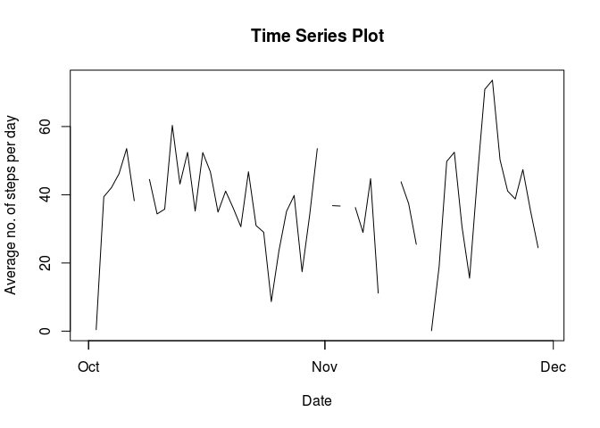
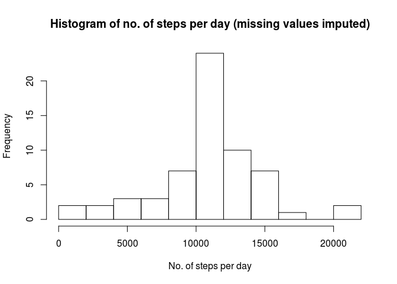
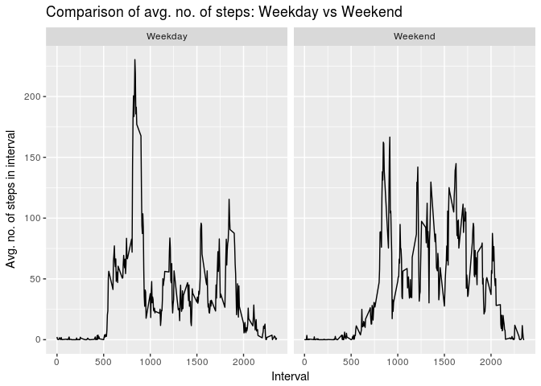

Reproducible Research / Course Project 1
========================================================

### 1. Preparing the environment
To avoid language problems, set system language to English.

```r
Sys.setenv("LANGUAGE"="En")
Sys.setlocale(locale = "en_US.UTF-8")
```

```
## [1] "LC_CTYPE=en_US.UTF-8;LC_NUMERIC=C;LC_TIME=en_US.UTF-8;LC_COLLATE=en_US.UTF-8;LC_MONETARY=en_US.UTF-8;LC_MESSAGES=de_DE.UTF-8;LC_PAPER=de_DE.UTF-8;LC_NAME=C;LC_ADDRESS=C;LC_TELEPHONE=C;LC_MEASUREMENT=de_DE.UTF-8;LC_IDENTIFICATION=C"
```
Load necessary libraries.

```r
library(ggplot2)
library(plyr)
```


### 2. Downloading and importing data
Next, the data is downloaded and unzipped if not already in place.

```r
fileUrl <- "https://d396qusza40orc.cloudfront.net/repdata%2Fdata%2Factivity.zip"
if(!file.exists("./Activity_Monitoring_data.zip") ) download.file(fileUrl, destfile="./Activity_Monitoring_data.zip", method="curl" )
if (!file.exists("./activity.csv")) unzip("./Activity_Monitoring_data.zip")
```
  
For further analysis, load data into R. For date/time analysis, the string date is transformed to class "POSIXlt".

```r
activitydata <- read.csv("activity.csv", colClasses = c("numeric","character","numeric"))
activitydata$date2 <- strptime(activitydata$date, "%Y-%m-%d")
```
      

### 3. Steps taken each day: total number / mean / median
Aggregate the steps per day. Then show a histogram of the total number of steps per day.

```r
steps_per_day <- aggregate(activitydata$steps, list(activitydata$date), FUN=sum)
names(steps_per_day) <- c("date","no_of_steps")
hist(steps_per_day$no_of_steps, breaks=10,main = "Histogram of no. of steps per day", xlab="No. of steps per day")
```

<!-- -->

Calculate the mean and the median of the total number of steps.

```r
steps_per_day_mean <- as.integer(mean(steps_per_day$no_of_steps, na.rm=TRUE))
steps_per_day_median <- as.integer(median(steps_per_day$no_of_steps, na.rm=TRUE))
```
Steps per day:   mean   =  10766  /  median =  10765  


### 4. Time series plot of average number of steps per interval
Calculate the average number of steps per interval. Then generate a time series plot.   
In order to show the time series plot date has to be transformed to class "POSIXlt".

```r
steps_perintervalday_avg <- aggregate(activitydata$steps, list(activitydata$date), FUN=mean)
names(steps_perintervalday_avg) <- c("date","avg_no_of_steps")
steps_perintervalday_avg$date2 <- strptime(steps_perintervalday_avg$date, "%Y-%m-%d")
plot(steps_perintervalday_avg$date2, steps_perintervalday_avg$avg_no_of_steps, type="l", 
     main="Time Series Plot", ylab="Average no. of steps per day", xlab="Date" )
```

<!-- -->


### 5. Interval which, on average, contains the maximum number of steps
To find the interval which, on average, contains the maximum number of steps, calculate the average    
number of steps per interval. To do this, first remove missing values. The interval number can be    
found using the which function.

```r
activitydata2 <- subset(activitydata,!is.na(activitydata$steps))
steps_perintervalno <- aggregate(activitydata2$steps, list(activitydata2$interval), FUN=mean)
names(steps_perintervalno) <- c("interval","avg_no_of_steps")

interval_max <- steps_perintervalno$interval[which.max(steps_perintervalno$avg_no_of_steps)]
```
Interval number:       835


### 6. Imputing missing data
Check whether there is missing data:  

```r
miss_steps <- sum(is.na(activitydata$steps))
miss_date <- sum(is.na(activitydata$date))
miss_interval <- sum(is.na(activitydata$interval))
```
Count of missing:   
- steps      2304   
- date       0    
- interval   0    
     
To impute missing data in steps, join the average number of steps per interval (as calculated in Step 5).  
The corrected value is assigned to steps2:   
- if steps is not missing, then assign given value   
- if steps is missing, then assign average number of steps per interval

```r
activitydata3 <- join(activitydata, steps_perintervalno, by= "interval", type="left")
activitydata3$steps2[is.na(activitydata3$steps)]  <- activitydata3$avg_no_of_steps[is.na(activitydata3$steps)]
activitydata3$steps2[!is.na(activitydata3$steps)]  <- activitydata3$steps[!is.na(activitydata3$steps)]
```


### 7. Comparing histograms of original and imputed data
As is step 3, calculate total number of steps per day using the imputed data.

```r
steps_per_day2 <- aggregate(activitydata3$steps2, list(activitydata$date), FUN=sum)
names(steps_per_day2) <- c("date","no_of_steps")
```

Here the histogram of the original data:      

```r
hist(steps_per_day$no_of_steps, breaks=10,main = "Histogram of no. of steps per day", xlab="No. of steps per day")
```

<!-- -->
     
And now the histogram of the imputed data:    

```r
hist(steps_per_day2$no_of_steps, breaks=10,main = "Histogram of no. of steps per day (missing values imputed)", xlab="No. of steps per day")
```

<!-- -->

Next calculate mean and medain of imputed data:

```r
steps_per_day2_mean <- as.integer(mean(steps_per_day2$no_of_steps, na.rm=TRUE))
steps_per_day2_median <- as.integer(median(steps_per_day2$no_of_steps, na.rm=TRUE))
```
Steps per day (unimputed / imputed)     
- mean    10766  /  10766    
- median  10765  / 10766      
   
The resulting differences are comparably small due to the chosen method of imputation.     


### 8. Comparing activity patterns between weekdays and weekends
Create a new variable which divides the days in weekend and weekday using the function "weekdays()".    

```r
activitydata3$type_of_day[weekdays(activitydata3$date2)=="Sunday" | weekdays(activitydata3$date2)=="Saturday"] <- "Weekend"
activitydata3$type_of_day[is.na(activitydata3$type_of_day)] <- "Weekday"
```
Calculate the average number  of steps per interval for the groups weekend and weekday.    
For comparison, plot average number of steps per interval for both groups.

```r
steps_perintervalno3 <- aggregate(activitydata3$steps2, list(interval = activitydata3$interval, 
                                                             type_of_day = activitydata3$type_of_day), mean)
names(steps_perintervalno3) <- c("interval","type_of_day", "avg_no_of_steps")

g <- ggplot(steps_perintervalno3, aes(interval, avg_no_of_steps))
g + geom_line() +
    facet_grid (. ~ type_of_day) + 
    labs(x="Interval",y="Avg. no. of steps in interval", title="Comparison of avg. no. of steps: Weekday vs Weekend")
```

<!-- -->
